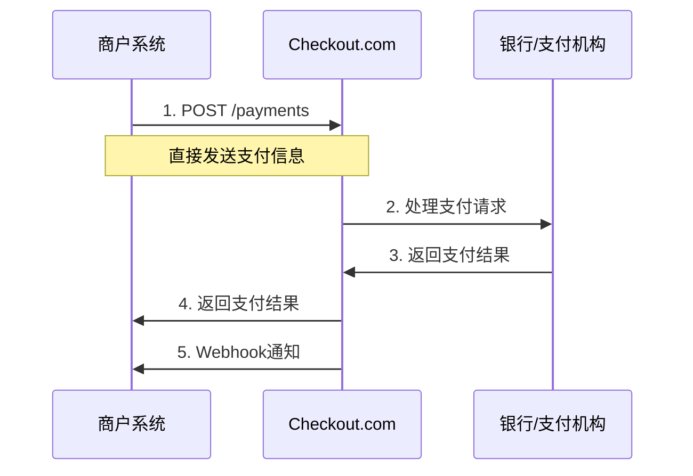

# Checkout.com API Direct 直接调用接入指南

## 概述

API Direct 是 Checkout.com 提供的直接 API 调用方式，商户可以直接调用支付 API 处理支付请求，需要完全控制支付流程和符合 PCI DSS 标准。

**相关文档：**
- 主文档：https://www.checkout.com/docs/payments/accept-payments
- API文档：https://api-reference.checkout.com/#operation/createAPayment

## 支付流程



## API 接口详情

### 1. 创建支付

**接口地址：** `POST /payments`

**文档地址：** https://api-reference.checkout.com/#operation/createAPayment

**请求示例：**
```json
{
  "source": {
    "type": "card",
    "number": "4242424242424242",
    "expiry_month": 12,
    "expiry_year": 2025,
    "cvv": "123"
  },
  "amount": 1000,
  "currency": "USD",
  "reference": "order_12345",
  "description": "Payment for order #12345",
  "customer": {
    "email": "customer@example.com",
    "name": "John Doe"
  },
  "billing_address": {
    "address_line1": "123 Main St",
    "city": "New York",
    "state": "NY",
    "zip": "10001",
    "country": "US"
  },
  "shipping_address": {
    "address_line1": "456 Ship St",
    "city": "New York",
    "state": "NY",
    "zip": "10002",
    "country": "US"
  },
  "metadata": {
    "order_id": "12345",
    "customer_id": "67890"
  },
  "3ds": {
    "enabled": true,
    "attempt_n3d": false
  }
}
```

**响应示例：**
```json
{
  "id": "pay_123456789",
  "amount": 1000,
  "currency": "USD",
  "reference": "order_12345",
  "status": "Authorized",
  "response_summary": "Approved",
  "source": {
    "type": "card",
    "id": "src_123456789",
    "last4": "4242",
    "scheme": "Visa",
    "expiry_month": 12,
    "expiry_year": 2025
  },
  "customer": {
    "id": "cus_123456789",
    "email": "customer@example.com",
    "name": "John Doe"
  },
  "billing_address": {
    "address_line1": "123 Main St",
    "city": "New York",
    "state": "NY",
    "zip": "10001",
    "country": "US"
  },
  "created_on": "2024-01-01T12:00:00Z",
  "risk": {
    "flagged": false
  }
}
```

### 2. 获取支付详情

**接口地址：** `GET /payments/{payment_id}`

**文档地址：** https://api-reference.checkout.com/#operation/getAPayment

### 3. 捕获支付

**接口地址：** `POST /payments/{payment_id}/captures`

**文档地址：** https://api-reference.checkout.com/#operation/captureAPayment

**请求示例：**
```json
{
  "amount": 1000,
  "reference": "capture_12345",
  "metadata": {
    "capture_reason": "Order fulfilled"
  }
}
```

### 4. 退款支付

**接口地址：** `POST /payments/{payment_id}/refunds`

**文档地址：** https://api-reference.checkout.com/#operation/refundAPayment

**请求示例：**
```json
{
  "amount": 500,
  "reference": "refund_12345",
  "metadata": {
    "refund_reason": "Customer request"
  }
}
```

### 5. 取消支付

**接口地址：** `POST /payments/{payment_id}/voids`

**文档地址：** https://api-reference.checkout.com/#operation/voidAPayment

## 支付方式支持

### 信用卡支付

```json
{
  "source": {
    "type": "card",
    "number": "4242424242424242",
    "expiry_month": 12,
    "expiry_year": 2025,
    "cvv": "123",
    "name": "John Doe",
    "billing_address": {
      "address_line1": "123 Main St",
      "city": "New York",
      "state": "NY",
      "zip": "10001",
      "country": "US"
    }
  }
}
```

### 使用 Token

```json
{
  "source": {
    "type": "token",
    "token": "tok_123456789"
  }
}
```

### 使用已保存的支付方式

```json
{
  "source": {
    "type": "id",
    "id": "src_123456789"
  }
}
```

### 数字钱包

```json
{
  "source": {
    "type": "applepay",
    "token_data": {
      "version": "EC_v1",
      "data": "base64_encoded_data",
      "signature": "base64_encoded_signature",
      "header": {
        "ephemeral_public_key": "base64_encoded_key",
        "public_key_hash": "base64_encoded_hash",
        "transaction_id": "transaction_id"
      }
    }
  }
}
```

### 本地支付方式

```json
{
  "source": {
    "type": "alipay",
    "data": "payment_data"
  }
}
```

## 3D Secure 配置

### 启用 3D Secure

```json
{
  "3ds": {
    "enabled": true,
    "attempt_n3d": false,
    "challenge_window_size": "02",
    "exemption": "low_value"
  }
}
```

### 3D Secure 响应处理

```json
{
  "id": "pay_123456789",
  "status": "Pending",
  "response_summary": "Pending 3DS",
  "3ds": {
    "enrolled": "Y",
    "version": "2.1.0",
    "upgrade_reason": "Card enrolled",
    "cryptogram": "cryptogram_value",
    "xid": "xid_value",
    "eci": "05"
  }
}
```

## 错误处理

### 常见错误码

| 错误码 | 描述 | 处理建议 |
|--------|------|----------|
| 20014 | 无效的金额 | 检查金额格式和范围 |
| 20015 | 无效的货币 | 检查货币代码 |
| 20016 | 无效的参考号 | 检查参考号格式 |
| 20017 | 无效的客户邮箱 | 检查邮箱格式 |
| 20018 | 无效的账单地址 | 检查地址信息 |
| 20019 | 卡号无效 | 检查卡号格式 |
| 20020 | 卡已过期 | 检查有效期 |
| 20021 | CVV 无效 | 检查 CVV 格式 |
| 20022 | 支付被拒绝 | 联系发卡行 |
| 20023 | 余额不足 | 建议用户检查余额 |
| 20024 | 3D Secure 认证失败 | 重新进行认证 |

### 错误响应示例

```json
{
  "request_id": "req_123456789",
  "error_type": "request_invalid",
  "error_codes": ["20014", "20015"],
  "http_status": 422,
  "response_summary": "Declined",
  "response_code": "20014"
}
```

## 安全考虑

### PCI DSS 合规

使用 API Direct 方式需要符合 PCI DSS 标准：

1. **数据加密**
   - 传输层使用 TLS 1.2+
   - 敏感数据加密存储

2. **访问控制**
   - 限制访问权限
   - 定期轮换密钥

3. **监控和日志**
   - 记录所有支付操作
   - 监控异常活动

4. **安全审计**
   - 定期安全评估
   - 漏洞扫描

### 最佳安全实践

```php
<?php
class SecurePaymentHandler
{
    private $apiKey;
    private $apiUrl;
    
    public function __construct($apiKey, $isSandbox = true)
    {
        $this->apiKey = $apiKey;
        $this->apiUrl = $isSandbox ? 'https://api.sandbox.checkout.com' : 'https://api.checkout.com';
    }
    
    public function createPayment($paymentData)
    {
        // 验证输入数据
        $this->validatePaymentData($paymentData);
        
        // 加密敏感数据
        $encryptedData = $this->encryptSensitiveData($paymentData);
        
        // 发送支付请求
        return $this->sendPaymentRequest($encryptedData);
    }
    
    private function validatePaymentData($data)
    {
        // 验证卡号格式
        if (!preg_match('/^\d{13,19}$/', $data['source']['number'])) {
            throw new InvalidArgumentException('Invalid card number');
        }
        
        // 验证有效期
        $currentYear = date('Y');
        if ($data['source']['expiry_year'] < $currentYear) {
            throw new InvalidArgumentException('Card expired');
        }
        
        // 验证 CVV
        if (!preg_match('/^\d{3,4}$/', $data['source']['cvv'])) {
            throw new InvalidArgumentException('Invalid CVV');
        }
    }
    
    private function encryptSensitiveData($data)
    {
        // 实现数据加密逻辑
        return $data;
    }
    
    private function sendPaymentRequest($data)
    {
        $url = $this->apiUrl . '/payments';
        
        $headers = [
            'Authorization: Bearer ' . $this->apiKey,
            'Content-Type: application/json',
            'User-Agent: YourApp/1.0'
        ];
        
        $ch = curl_init();
        curl_setopt($ch, CURLOPT_URL, $url);
        curl_setopt($ch, CURLOPT_POST, true);
        curl_setopt($ch, CURLOPT_POSTFIELDS, json_encode($data));
        curl_setopt($ch, CURLOPT_HTTPHEADER, $headers);
        curl_setopt($ch, CURLOPT_RETURNTRANSFER, true);
        curl_setopt($ch, CURLOPT_SSL_VERIFYPEER, true);
        curl_setopt($ch, CURLOPT_TIMEOUT, 30);
        
        $response = curl_exec($ch);
        $httpCode = curl_getinfo($ch, CURLINFO_HTTP_CODE);
        $error = curl_error($ch);
        curl_close($ch);
        
        if ($error) {
            throw new Exception('CURL Error: ' . $error);
        }
        
        $result = json_decode($response, true);
        
        if ($httpCode >= 400) {
            throw new PaymentException($result['response_summary'], $result['response_code']);
        }
        
        return $result;
    }
}

class PaymentException extends Exception
{
    private $responseCode;
    
    public function __construct($message, $responseCode = null)
    {
        parent::__construct($message);
        $this->responseCode = $responseCode;
    }
    
    public function getResponseCode()
    {
        return $this->responseCode;
    }
}
?>
```

## 测试环境

### Sandbox 配置

```php
// 测试环境配置
$checkout = new SecurePaymentHandler('sk_test_123456789', true);

// 测试卡号
$testCards = [
    'visa' => '4242424242424242',
    'mastercard' => '5555555555554444',
    'amex' => '378282246310005',
    '3ds' => '4000000000000002'
];
```

### 测试流程

1. **基本支付测试**
   ```php
   $paymentData = [
       'source' => [
           'type' => 'card',
           'number' => '4242424242424242',
           'expiry_month' => 12,
           'expiry_year' => 2025,
           'cvv' => '123'
       ],
       'amount' => 1000,
       'currency' => 'USD',
       'reference' => 'test_order_001'
   ];
   
   $result = $checkout->createPayment($paymentData);
   ```

2. **3D Secure 测试**
   ```php
   $paymentData['3ds'] = [
       'enabled' => true,
       'attempt_n3d' => false
   ];
   ```

3. **错误处理测试**
   ```php
   // 测试无效卡号
   $paymentData['source']['number'] = '4000000000000002';
   ```

## 监控和日志

### 支付日志记录

```php
class PaymentLogger
{
    public function logPayment($paymentData, $response, $status)
    {
        $logData = [
            'timestamp' => date('Y-m-d H:i:s'),
            'payment_id' => $response['id'] ?? null,
            'amount' => $paymentData['amount'],
            'currency' => $paymentData['currency'],
            'reference' => $paymentData['reference'],
            'status' => $status,
            'response_code' => $response['response_code'] ?? null,
            'response_summary' => $response['response_summary'] ?? null,
            'ip_address' => $_SERVER['REMOTE_ADDR'] ?? null,
            'user_agent' => $_SERVER['HTTP_USER_AGENT'] ?? null
        ];
        
        // 记录到数据库或日志文件
        $this->writeLog($logData);
    }
    
    private function writeLog($data)
    {
        // 实现日志写入逻辑
        error_log(json_encode($data) . "\n", 3, '/var/log/payments.log');
    }
}
```

### 监控指标

1. **支付成功率**
   - 成功支付数 / 总支付数
   - 按时间段统计

2. **错误率监控**
   - 各种错误码的分布
   - 异常交易监控

3. **性能监控**
   - API 响应时间
   - 超时率

## 最佳实践

### 1. 数据验证

```php
function validatePaymentRequest($data)
{
    $errors = [];
    
    // 验证金额
    if (!is_numeric($data['amount']) || $data['amount'] <= 0) {
        $errors[] = 'Invalid amount';
    }
    
    // 验证货币
    if (!preg_match('/^[A-Z]{3}$/', $data['currency'])) {
        $errors[] = 'Invalid currency';
    }
    
    // 验证参考号
    if (empty($data['reference']) || strlen($data['reference']) > 50) {
        $errors[] = 'Invalid reference';
    }
    
    // 验证客户信息
    if (!filter_var($data['customer']['email'], FILTER_VALIDATE_EMAIL)) {
        $errors[] = 'Invalid email';
    }
    
    return $errors;
}
```

### 2. 幂等性处理

```php
function createPaymentWithIdempotency($paymentData, $idempotencyKey)
{
    // 检查是否已存在相同的请求
    $existingPayment = $this->findPaymentByKey($idempotencyKey);
    if ($existingPayment) {
        return $existingPayment;
    }
    
    // 创建新支付
    $payment = $this->createPayment($paymentData);
    
    // 保存幂等性键
    $this->saveIdempotencyKey($idempotencyKey, $payment['id']);
    
    return $payment;
}
```

### 3. 重试机制

```php
function createPaymentWithRetry($paymentData, $maxRetries = 3)
{
    $attempts = 0;
    
    while ($attempts < $maxRetries) {
        try {
            return $this->createPayment($paymentData);
        } catch (PaymentException $e) {
            $attempts++;
            
            // 如果是最终错误，不再重试
            if ($this->isFinalError($e->getResponseCode())) {
                throw $e;
            }
            
            // 等待后重试
            if ($attempts < $maxRetries) {
                sleep(pow(2, $attempts)); // 指数退避
            }
        }
    }
    
    throw new Exception('Max retries exceeded');
}
```

## 常见问题

### Q: 如何处理支付超时？
A: 实现重试机制和超时处理，设置合理的超时时间。

### Q: 如何支持多种货币？
A: 根据用户地区或偏好设置 currency 参数，注意汇率转换。

### Q: 如何处理部分退款？
A: 使用退款 API 接口，指定退款金额。

### Q: 如何确保 PCI DSS 合规？
A: 实施数据加密、访问控制、监控和审计等安全措施。 