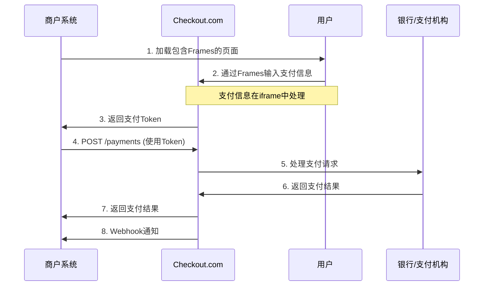

# Checkout.com Frames 嵌入式支付表单接入指南

## 概述

Frames 是 Checkout.com 提供的嵌入式支付表单解决方案，允许商户在自己的网站中嵌入支付表单，同时保持 PCI DSS 合规性。

**相关文档：**
- 主文档：https://www.checkout.com/docs/payments/frames
- API文档：https://api-reference.checkout.com/#operation/createAPayment

## 支付流程



## Frames 集成

### 1. 引入 Frames JavaScript

```html
<!DOCTYPE html>
<html>
<head>
    <title>支付页面</title>
    <script src="https://cdn.checkout.com/js/framesv2.min.js"></script>
</head>
<body>
    <form id="payment-form">
        <div class="form-row">
            <label for="card-number">卡号</label>
            <div class="input-wrapper">
                <div id="card-number-frame" class="frame-container"></div>
            </div>
        </div>
        
        <div class="form-row">
            <label for="expiry-date">有效期</label>
            <div class="input-wrapper">
                <div id="expiry-date-frame" class="frame-container"></div>
            </div>
        </div>
        
        <div class="form-row">
            <label for="cvv">CVV</label>
            <div class="input-wrapper">
                <div id="cvv-frame" class="frame-container"></div>
            </div>
        </div>
        
        <button type="submit">支付</button>
    </form>
</body>
</html>
```

### 2. 初始化 Frames

```javascript
// 初始化 Frames
Frames.init({
    publicKey: 'pk_test_123456789',
    localization: {
        cardNumberPlaceholder: "卡号",
        expiryMonthPlaceholder: "月",
        expiryYearPlaceholder: "年",
        cvvPlaceholder: "CVV"
    }
});

// 监听 Frames 事件
Frames.on('ready', function () {
    console.log('Frames is ready');
});

Frames.on('cardValidationChanged', function () {
    console.log('Card validation changed');
});

Frames.on('cardTokenized', function (event) {
    console.log('Card tokenized:', event.token);
    // 发送 token 到服务器
    submitPayment(event.token);
});

Frames.on('paymentMethodChanged', function (event) {
    console.log('Payment method changed:', event.paymentMethod);
});

Frames.on('error', function (event) {
    console.error('Frames error:', event);
});
```

### 3. 处理支付提交

```javascript
function submitPayment(token) {
    const paymentData = {
        source: {
            type: 'token',
            token: token
        },
        amount: 1000,
        currency: 'USD',
        reference: 'order_12345',
        description: 'Payment for order #12345',
        customer: {
            email: 'customer@example.com',
            name: 'John Doe'
        },
        billing_address: {
            address_line1: '123 Main St',
            city: 'New York',
            state: 'NY',
            zip: '10001',
            country: 'US'
        }
    };
    
    fetch('/api/payments', {
        method: 'POST',
        headers: {
            'Content-Type': 'application/json',
            'Authorization': 'Bearer ' + serverApiKey
        },
        body: JSON.stringify(paymentData)
    })
    .then(response => response.json())
    .then(data => {
        if (data.status === 'Approved') {
            window.location.href = '/success';
        } else {
            alert('支付失败: ' + data.response_summary);
        }
    })
    .catch(error => {
        console.error('Payment error:', error);
        alert('支付处理出错');
    });
}
```

## API 接口详情

### 创建支付

**接口地址：** `POST /payments`

**文档地址：** https://api-reference.checkout.com/#operation/createAPayment

**请求示例：**
```json
{
  "source": {
    "type": "token",
    "token": "tok_123456789"
  },
  "amount": 1000,
  "currency": "USD",
  "reference": "order_12345",
  "description": "Payment for order #12345",
  "customer": {
    "email": "customer@example.com",
    "name": "John Doe"
  },
  "billing_address": {
    "address_line1": "123 Main St",
    "city": "New York",
    "state": "NY",
    "zip": "10001",
    "country": "US"
  },
  "metadata": {
    "order_id": "12345",
    "customer_id": "67890"
  }
}
```

**响应示例：**
```json
{
  "id": "pay_123456789",
  "amount": 1000,
  "currency": "USD",
  "reference": "order_12345",
  "status": "Authorized",
  "response_summary": "Approved",
  "source": {
    "type": "card",
    "id": "src_123456789",
    "last4": "1234",
    "scheme": "Visa",
    "expiry_month": 12,
    "expiry_year": 2025
  },
  "customer": {
    "id": "cus_123456789",
    "email": "customer@example.com",
    "name": "John Doe"
  },
  "created_on": "2024-01-01T12:00:00Z"
}
```

## Frames 配置选项

### 基本配置
```javascript
Frames.init({
    publicKey: 'pk_test_123456789',
    debugMode: false,
    cardholderName: {
        placeholder: "持卡人姓名"
    },
    localization: {
        cardNumberPlaceholder: "卡号",
        expiryMonthPlaceholder: "月",
        expiryYearPlaceholder: "年",
        cvvPlaceholder: "CVV"
    }
});
```

### 样式配置
```javascript
Frames.init({
    publicKey: 'pk_test_123456789',
    style: {
        base: {
            fontSize: '16px',
            color: '#333',
            fontFamily: 'Arial, sans-serif'
        },
        valid: {
            color: '#4CAF50'
        },
        invalid: {
            color: '#F44336'
        },
        placeholder: {
            base: {
                color: '#999'
            }
        }
    }
});
```

### 验证配置
```javascript
Frames.init({
    publicKey: 'pk_test_123456789',
    cardValidationChanged: function (event) {
        // 自定义验证逻辑
        if (event.isValid) {
            document.getElementById('submit-button').disabled = false;
        } else {
            document.getElementById('submit-button').disabled = true;
        }
    }
});
```

## 支付方式支持

### 信用卡
```javascript
// 默认支持所有主要信用卡
// Visa, Mastercard, American Express, Discover, JCB, Diners Club
```

### 数字钱包
```javascript
// 需要额外的配置
Frames.init({
    publicKey: 'pk_test_123456789',
    paymentMethodTypes: ['card', 'applepay', 'googlepay']
});
```

### 本地支付方式
```javascript
// 根据地区显示相应的支付方式
Frames.init({
    publicKey: 'pk_test_123456789',
    locale: 'zh-CN',
    paymentMethodTypes: ['card', 'alipay', 'wechatpay']
});
```

## 错误处理

### Frames 错误事件
```javascript
Frames.on('error', function (event) {
    console.error('Frames error:', event);
    
    switch (event.errorCode) {
        case 'FRAME_VALIDATION_ERROR':
            alert('输入信息有误，请检查');
            break;
        case 'FRAME_TOKENIZATION_ERROR':
            alert('支付信息处理失败，请重试');
            break;
        case 'FRAME_INITIALIZATION_ERROR':
            alert('支付系统初始化失败');
            break;
        default:
            alert('支付处理出错，请重试');
    }
});
```

### API 错误处理
```javascript
function handlePaymentError(error) {
    if (error.response_summary) {
        switch (error.response_summary) {
            case 'Declined':
                alert('支付被拒绝: ' + error.response_code);
                break;
            case 'Expired':
                alert('支付已过期');
                break;
            case 'Insufficient Funds':
                alert('余额不足');
                break;
            default:
                alert('支付失败: ' + error.response_summary);
        }
    } else {
        alert('支付处理出错，请重试');
    }
}
```

## 安全考虑

### PCI DSS 合规
- Frames 完全符合 PCI DSS 标准
- 敏感支付数据在 iframe 中处理
- 商户服务器不接触支付信息

### 3D Secure 支持
```javascript
// 自动处理 3D Secure
Frames.init({
    publicKey: 'pk_test_123456789',
    challengeWindowSize: '02' // 390x400px
});
```

### 欺诈检测
- 内置实时欺诈检测
- 风险评估和阻止可疑交易
- 可配置风险规则

## 测试环境

### Sandbox 配置
```javascript
// 测试环境
Frames.init({
    publicKey: 'pk_test_123456789', // 测试公钥
    debugMode: true
});
```

### 测试卡号
- Visa: 4242424242424242
- Mastercard: 5555555555554444
- American Express: 378282246310005
- 3D Secure: 4000000000000002

### 测试流程
1. 使用测试卡号在 Frames 中输入
2. 验证 Token 生成
3. 调用支付 API
4. 检查支付结果

## 最佳实践

### 1. 用户体验
- 提供清晰的支付说明
- 显示支付进度指示器
- 优化表单验证反馈

### 2. 错误处理
- 实现完善的错误处理机制
- 提供用户友好的错误信息
- 记录错误日志用于调试

### 3. 性能优化
- 预加载 Frames 资源
- 优化页面加载速度
- 减少不必要的 API 调用

### 4. 监控和告警
- 监控支付成功率
- 设置异常交易告警
- 定期检查 Frames 状态

## 集成示例

### 完整支付页面示例
```html
<!DOCTYPE html>
<html>
<head>
    <title>支付页面</title>
    <script src="https://cdn.checkout.com/js/framesv2.min.js"></script>
    <style>
        .frame-container {
            border: 1px solid #ccc;
            border-radius: 4px;
            padding: 10px;
            margin: 5px 0;
        }
        .form-row {
            margin: 15px 0;
        }
        .form-row label {
            display: block;
            margin-bottom: 5px;
            font-weight: bold;
        }
        .submit-button {
            background: #007bff;
            color: white;
            padding: 10px 20px;
            border: none;
            border-radius: 4px;
            cursor: pointer;
        }
        .submit-button:disabled {
            background: #ccc;
            cursor: not-allowed;
        }
    </style>
</head>
<body>
    <h1>支付信息</h1>
    <form id="payment-form">
        <div class="form-row">
            <label for="card-number">卡号</label>
            <div id="card-number-frame" class="frame-container"></div>
        </div>
        
        <div class="form-row">
            <label for="expiry-date">有效期</label>
            <div id="expiry-date-frame" class="frame-container"></div>
        </div>
        
        <div class="form-row">
            <label for="cvv">CVV</label>
            <div id="cvv-frame" class="frame-container"></div>
        </div>
        
        <button type="submit" class="submit-button" disabled>支付</button>
    </form>

    <script>
        // 初始化 Frames
        Frames.init({
            publicKey: 'pk_test_123456789',
            localization: {
                cardNumberPlaceholder: "卡号",
                expiryMonthPlaceholder: "月",
                expiryYearPlaceholder: "年",
                cvvPlaceholder: "CVV"
            }
        });

        // 监听事件
        Frames.on('ready', function () {
            console.log('Frames is ready');
        });

        Frames.on('cardValidationChanged', function () {
            console.log('Card validation changed');
        });

        Frames.on('cardTokenized', function (event) {
            console.log('Card tokenized:', event.token);
            submitPayment(event.token);
        });

        Frames.on('error', function (event) {
            console.error('Frames error:', event);
            alert('支付处理出错，请重试');
        });

        // 处理表单提交
        document.getElementById('payment-form').addEventListener('submit', function (e) {
            e.preventDefault();
            Frames.submitCard();
        });

        function submitPayment(token) {
            // 发送到服务器处理
            fetch('/api/payments', {
                method: 'POST',
                headers: {
                    'Content-Type': 'application/json'
                },
                body: JSON.stringify({
                    token: token,
                    amount: 1000,
                    currency: 'USD',
                    reference: 'order_12345'
                })
            })
            .then(response => response.json())
            .then(data => {
                if (data.status === 'Approved') {
                    window.location.href = '/success';
                } else {
                    alert('支付失败: ' + data.response_summary);
                }
            })
            .catch(error => {
                console.error('Payment error:', error);
                alert('支付处理出错');
            });
        }
    </script>
</body>
</html>
```

## 常见问题

### Q: 如何处理 3D Secure 认证？
A: Frames 会自动处理 3D Secure 认证，无需额外配置。

### Q: 如何自定义 Frames 样式？
A: 使用 style 配置选项自定义 iframe 样式。

### Q: 如何支持多种支付方式？
A: 使用 paymentMethodTypes 配置支持不同的支付方式。

### Q: 如何处理支付失败？
A: 监听 error 事件并实现相应的错误处理逻辑。 