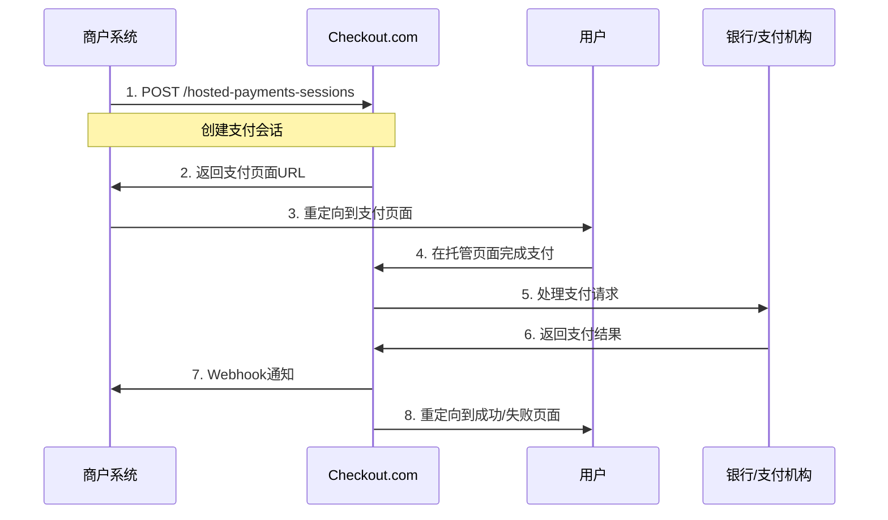

# Checkout.com Hosted Payments Page 接入指南

## 概述

Hosted Payments Page 是 Checkout.com 提供的托管支付页面解决方案，商户无需处理敏感支付数据，符合 PCI DSS 合规要求。

**相关文档：**
- 主文档：https://www.checkout.com/docs/payments/hosted-payments-page
- API文档：https://api-reference.checkout.com/#operation/createAHostedPaymentsSession

## 支付流程



## API 接口详情

### 1. 创建 Hosted Payments Session

**接口地址：** `POST /hosted-payments-sessions`

**文档地址：** https://api-reference.checkout.com/#operation/createAHostedPaymentsSession

**请求示例：**
```json
{
  "amount": 1000,
  "currency": "USD",
  "reference": "order_12345",
  "description": "Payment for order #12345",
  "customer": {
    "email": "customer@example.com",
    "name": "John Doe"
  },
  "billing_address": {
    "address_line1": "123 Main St",
    "city": "New York",
    "state": "NY",
    "zip": "10001",
    "country": "US"
  },
  "success_url": "https://your-domain.com/success",
  "cancel_url": "https://your-domain.com/cancel",
  "failure_url": "https://your-domain.com/failure",
  "metadata": {
    "order_id": "12345",
    "customer_id": "67890"
  }
}
```

**响应示例：**
```json
{
  "id": "hps_123456789",
  "reference": "order_12345",
  "amount": 1000,
  "currency": "USD",
  "status": "pending",
  "created_on": "2024-01-01T12:00:00Z",
  "links": {
    "payment": "https://pay.checkout.com/hosted-payments/hps_123456789"
  }
}
```

### 2. 获取 Session 详情

**接口地址：** `GET /hosted-payments-sessions/{session_id}`

**文档地址：** https://api-reference.checkout.com/#operation/getAHostedPaymentsSession

### 3. 更新 Session

**接口地址：** `PUT /hosted-payments-sessions/{session_id}`

**文档地址：** https://api-reference.checkout.com/#operation/updateAHostedPaymentsSession

## Webhook 通知

### 事件类型

1. **payment_approved** - 支付成功
2. **payment_declined** - 支付失败
3. **payment_captured** - 支付已捕获
4. **payment_refunded** - 支付已退款

### Webhook 验证

**文档地址：** https://www.checkout.com/docs/payments/webhooks

验证签名示例：
```php
$signature = $_SERVER['HTTP_CKO_SIGNATURE'];
$payload = file_get_contents('php://input');
$expectedSignature = hash_hmac('sha256', $payload, $webhookSecret);

if (hash_equals($expectedSignature, $signature)) {
    // 验证成功，处理webhook
} else {
    // 验证失败
}
```

## 配置参数

### 必需参数
- `amount` - 支付金额（以最小货币单位计）
- `currency` - 货币代码（ISO 4217）
- `reference` - 商户订单号
- `success_url` - 支付成功跳转地址
- `cancel_url` - 取消支付跳转地址

### 可选参数
- `description` - 支付描述
- `customer` - 客户信息
- `billing_address` - 账单地址
- `shipping_address` - 收货地址
- `metadata` - 自定义元数据
- `failure_url` - 支付失败跳转地址
- `locale` - 页面语言
- `payment_method_types` - 支持的支付方式

## 支付方式配置

### 信用卡
```json
{
  "payment_method_types": ["card"],
  "card": {
    "billing_address": {
      "address_line1": "123 Main St",
      "city": "New York",
      "state": "NY",
      "zip": "10001",
      "country": "US"
    }
  }
}
```

### 数字钱包
```json
{
  "payment_method_types": ["applepay", "googlepay"],
  "applepay": {
    "merchant_id": "merchant.com.yourcompany"
  }
}
```

### 本地支付方式
```json
{
  "payment_method_types": ["alipay", "wechatpay"],
  "locale": "zh-CN"
}
```

## 错误处理

### 常见错误码
- `20014` - 无效的金额
- `20015` - 无效的货币
- `20016` - 无效的参考号
- `20017` - 无效的客户邮箱
- `20018` - 无效的账单地址

### 错误响应示例
```json
{
  "request_id": "req_123456789",
  "error_type": "request_invalid",
  "error_codes": ["20014"],
  "http_status": 422
}
```

## 安全考虑

### PCI DSS 合规
- Hosted Payments Page 完全符合 PCI DSS 标准
- 商户无需处理敏感支付数据
- 所有支付信息在 Checkout.com 安全环境中处理

### 3D Secure
- 自动支持 3D Secure 认证
- 根据发卡行要求自动触发
- 支持 3D Secure 2.0

### 欺诈检测
- 内置实时欺诈检测
- 风险评估和阻止可疑交易
- 可配置风险规则

## 测试环境

### Sandbox 环境
- 测试 URL：https://api.sandbox.checkout.com
- 测试卡号：https://www.checkout.com/docs/testing/test-cards
- 测试 Webhook：https://webhook.site

### 测试流程
1. 使用测试卡号创建支付会话
2. 完成测试支付流程
3. 验证 Webhook 通知
4. 检查支付状态更新

## 最佳实践

### 1. 订单管理
- 使用唯一的订单号作为 reference
- 实现幂等性处理
- 记录详细的支付日志

### 2. 用户体验
- 提供清晰的支付说明
- 设置合适的超时时间
- 优化成功/失败页面

### 3. 错误处理
- 实现完善的错误处理机制
- 提供用户友好的错误信息
- 记录错误日志用于调试

### 4. 监控和告警
- 监控支付成功率
- 设置异常交易告警
- 定期检查 Webhook 状态

## 集成示例

### PHP 集成示例
```php
<?php
class CheckoutHostedPayments
{
    private $apiKey;
    private $apiUrl;
    
    public function __construct($apiKey, $isSandbox = true)
    {
        $this->apiKey = $apiKey;
        $this->apiUrl = $isSandbox ? 'https://api.sandbox.checkout.com' : 'https://api.checkout.com';
    }
    
    public function createSession($orderData)
    {
        $url = $this->apiUrl . '/hosted-payments-sessions';
        
        $headers = [
            'Authorization: Bearer ' . $this->apiKey,
            'Content-Type: application/json'
        ];
        
        $data = [
            'amount' => $orderData['amount'],
            'currency' => $orderData['currency'],
            'reference' => $orderData['order_id'],
            'description' => $orderData['description'],
            'success_url' => $orderData['success_url'],
            'cancel_url' => $orderData['cancel_url'],
            'failure_url' => $orderData['failure_url'],
            'customer' => [
                'email' => $orderData['customer_email'],
                'name' => $orderData['customer_name']
            ]
        ];
        
        $ch = curl_init();
        curl_setopt($ch, CURLOPT_URL, $url);
        curl_setopt($ch, CURLOPT_POST, true);
        curl_setopt($ch, CURLOPT_POSTFIELDS, json_encode($data));
        curl_setopt($ch, CURLOPT_HTTPHEADER, $headers);
        curl_setopt($ch, CURLOPT_RETURNTRANSFER, true);
        
        $response = curl_exec($ch);
        $httpCode = curl_getinfo($ch, CURLINFO_HTTP_CODE);
        curl_close($ch);
        
        if ($httpCode === 201) {
            return json_decode($response, true);
        } else {
            throw new Exception('Failed to create payment session: ' . $response);
        }
    }
}
?>
```

## 常见问题

### Q: 如何处理支付超时？
A: 设置合适的超时时间，并在失败页面提供重试选项。

### Q: 如何支持多种货币？
A: 根据用户地区或偏好设置 currency 参数。

### Q: 如何处理部分退款？
A: 使用单独的退款 API 接口处理部分退款。

### Q: 如何自定义支付页面样式？
A: Hosted Payments Page 支持有限的自定义，主要通过 locale 和 payment_method_types 参数。 