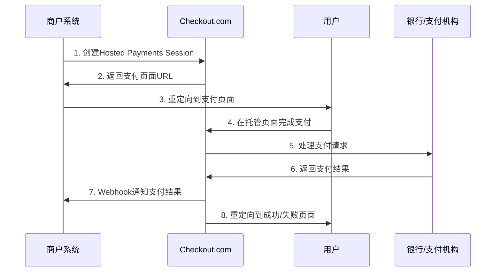
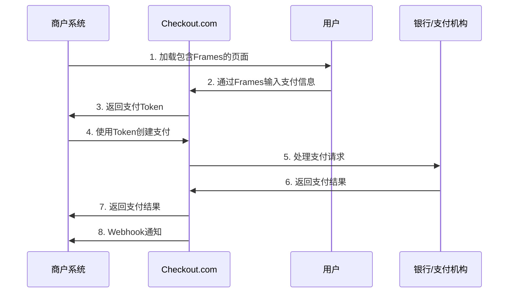
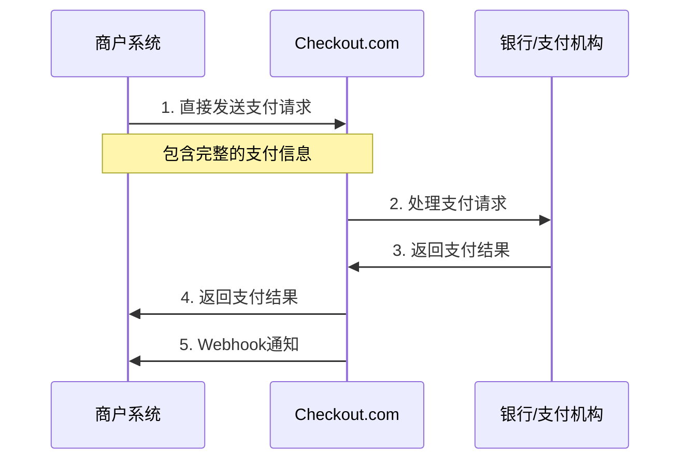
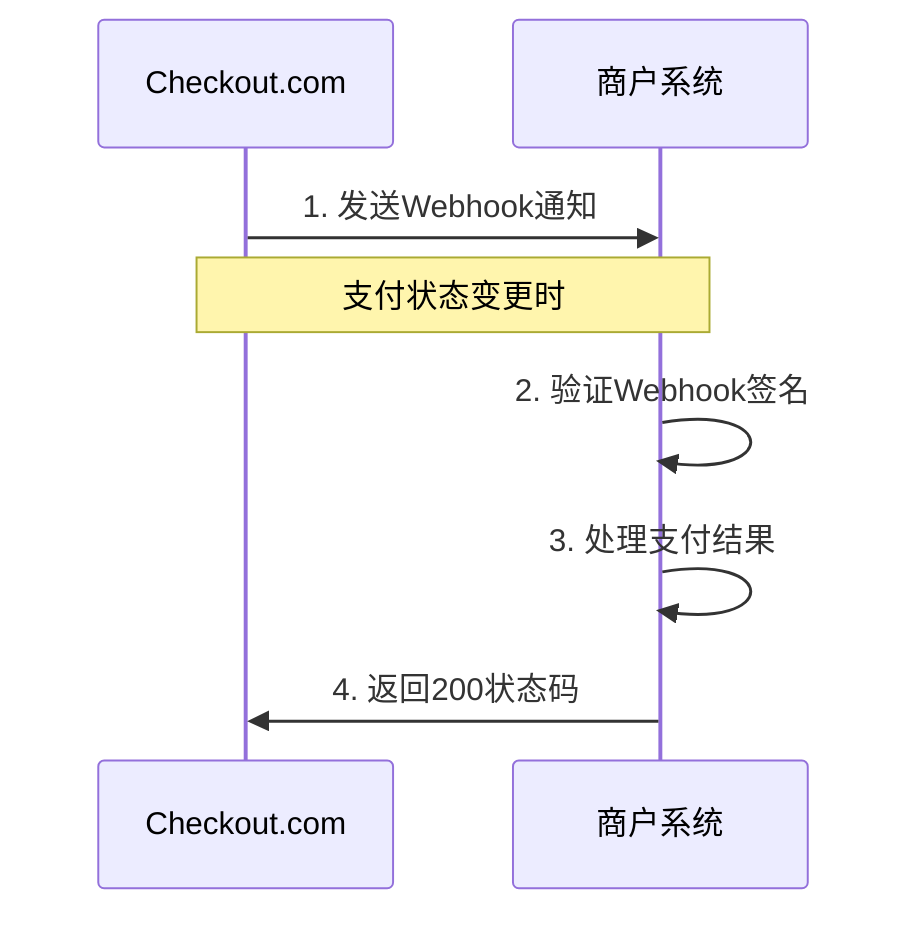

# Checkout.com 支付平台接入分析

## 概述

Checkout.com 是一个全球性的支付处理平台，提供多种支付接入方式，支持全球200多个国家和地区的支付方式。

**官方文档地址：**
- 主文档：https://www.checkout.com/docs
- API参考：https://api-reference.checkout.com/
- 支付方式：https://www.checkout.com/zh-cn/payment-method/accept

## 接入方式概览

Checkout.com 提供以下几种主要的接入方式：

1. **Hosted Payments Page (托管支付页面)**
2. **Frames (嵌入式支付表单)**
3. **API Direct (直接API调用)**
4. **Webhooks (支付通知)**
5. **Mobile SDKs (移动端SDK)**

---

## 1. Hosted Payments Page (托管支付页面)

### 支付流程

### 详细流程说明

1. **创建支付会话**
   - 商户调用API创建Hosted Payments Session
   - 接口：`POST /hosted-payments-sessions`
   - 文档：https://api-reference.checkout.com/#operation/createAHostedPaymentsSession

2. **获取支付页面**
   - Checkout.com返回支付页面URL
   - 商户将用户重定向到该URL

3. **用户支付**
   - 用户在Checkout.com托管的页面完成支付
   - 支持多种支付方式：信用卡、数字钱包、本地支付等

4. **支付结果处理**
   - 通过Webhook接收支付结果通知
   - 用户被重定向到商户指定的成功/失败页面

### 适用场景
- 快速集成支付功能
- 无需处理敏感支付数据
- 支持多种支付方式
- 符合PCI DSS合规要求

---

## 2. Frames (嵌入式支付表单)

### 支付流程

### 详细流程说明

1. **集成Frames**
   - 在商户页面嵌入Checkout.com的Frames
   - 用户直接在商户页面输入支付信息

2. **获取支付Token**
   - Frames将支付信息转换为Token
   - 商户获得Token后调用支付API

3. **创建支付**
   - 使用Token创建支付请求
   - 接口：`POST /payments`
   - 文档：https://api-reference.checkout.com/#operation/createAPayment

### 适用场景
- 需要自定义支付页面UI
- 保持用户在商户网站内
- 需要更多支付流程控制

---

## 3. API Direct (直接API调用)

### 支付流程

### 详细流程说明

1. **直接支付请求**
   - 商户直接调用支付API
   - 需要处理完整的支付信息
   - 接口：`POST /payments`
   - 文档：https://api-reference.checkout.com/#operation/createAPayment

2. **支付信息处理**
   - 需要符合PCI DSS标准
   - 处理敏感支付数据

### 适用场景
- 完全控制支付流程
- 需要处理复杂的支付逻辑
- 有PCI DSS合规能力

---

## 4. Webhooks (支付通知)

### 通知流程

### 详细说明

1. **Webhook配置**
   - 在Checkout.com后台配置Webhook URL
   - 设置通知事件类型

2. **事件类型**
   - `payment_approved` - 支付成功
   - `payment_declined` - 支付失败
   - `payment_captured` - 支付已捕获
   - `payment_refunded` - 支付已退款

3. **安全验证**
   - 验证Webhook签名
   - 确保通知来源可信

### 适用场景
- 实时接收支付状态更新
- 自动化订单处理
- 支付结果通知

---

## 5. 支付方式支持

### 信用卡支付
- Visa、Mastercard、American Express等
- 支持3D Secure认证
- 支持Token化存储

### 数字钱包
- Apple Pay、Google Pay、Samsung Pay
- PayPal、Alipay、WeChat Pay

### 本地支付方式
- 银行转账
- 电子钱包
- 现金支付

### 分期付款
- 支持多种分期方案
- 灵活的还款计划

---

## 安全与合规

### PCI DSS合规
- Hosted Payments Page和Frames符合PCI DSS标准
- 商户无需处理敏感支付数据

### 3D Secure
- 支持3D Secure 2.0
- 增强支付安全性

### 欺诈检测
- 内置欺诈检测系统
- 实时风险评估

---

## 费率结构

### 交易费用
- 按交易金额收取百分比费用
- 不同支付方式费率不同
- 跨境交易额外费用

### 月费
- 部分功能需要月费
- 根据交易量调整

---

## 集成建议

### 开发环境
- 使用Sandbox环境进行测试
- 完整的测试支付流程

### 生产环境
- 配置Webhook通知
- 实现错误处理机制
- 监控支付成功率

### 最佳实践
- 实现幂等性处理
- 记录详细的支付日志
- 定期对账和结算 