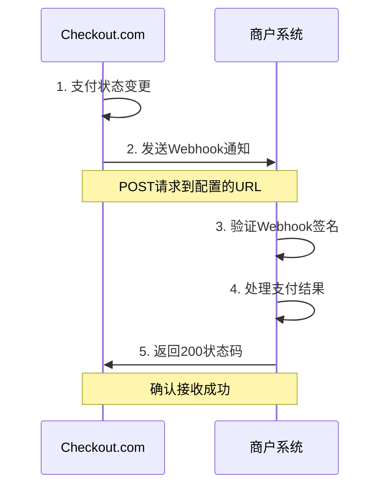

# Checkout.com Webhooks 支付通知接入指南

## 概述

Webhooks 是 Checkout.com 提供的实时通知机制，当支付状态发生变化时，Checkout.com 会向商户指定的 URL 发送通知。

**相关文档：**
- 主文档：https://www.checkout.com/docs/payments/webhooks
- API文档：https://api-reference.checkout.com/#operation/getWebhook

## 通知流程



## Webhook 配置

### 1. 创建 Webhook

**接口地址：** `POST /webhooks`

**文档地址：** https://api-reference.checkout.com/#operation/createAWebhook

**请求示例：**
```json
{
  "url": "https://your-domain.com/webhooks/checkout",
  "active": true,
  "headers": {
    "Authorization": "Bearer your-secret-token"
  },
  "content_type": "json",
  "event_types": [
    "payment_approved",
    "payment_declined",
    "payment_captured",
    "payment_refunded",
    "payment_voided",
    "payment_expired"
  ]
}
```

**响应示例：**
```json
{
  "id": "whk_123456789",
  "url": "https://your-domain.com/webhooks/checkout",
  "active": true,
  "headers": {
    "Authorization": "Bearer your-secret-token"
  },
  "content_type": "json",
  "event_types": [
    "payment_approved",
    "payment_declined",
    "payment_captured",
    "payment_refunded",
    "payment_voided",
    "payment_expired"
  ],
  "created_on": "2024-01-01T12:00:00Z"
}
```

### 2. 获取 Webhook 列表

**接口地址：** `GET /webhooks`

**文档地址：** https://api-reference.checkout.com/#operation/getWebhooks

### 3. 更新 Webhook

**接口地址：** `PUT /webhooks/{webhook_id}`

**文档地址：** https://api-reference.checkout.com/#operation/updateAWebhook

### 4. 删除 Webhook

**接口地址：** `DELETE /webhooks/{webhook_id}`

**文档地址：** https://api-reference.checkout.com/#operation/deleteAWebhook

## 事件类型

### 支付事件

| 事件类型 | 描述 | 触发时机 |
|----------|------|----------|
| `payment_approved` | 支付成功 | 支付被批准 |
| `payment_declined` | 支付失败 | 支付被拒绝 |
| `payment_captured` | 支付已捕获 | 预授权支付被捕获 |
| `payment_refunded` | 支付已退款 | 支付被退款 |
| `payment_voided` | 支付已取消 | 支付被取消 |
| `payment_expired` | 支付已过期 | 支付超时过期 |

### 其他事件

| 事件类型 | 描述 | 触发时机 |
|----------|------|----------|
| `source_updated` | 支付方式更新 | 支付方式信息更新 |
| `customer_updated` | 客户信息更新 | 客户信息变更 |
| `dispute_created` | 争议创建 | 支付争议产生 |
| `dispute_updated` | 争议更新 | 争议状态变更 |

## Webhook 数据格式

### 支付成功通知

```json
{
  "type": "payment_approved",
  "created_on": "2024-01-01T12:00:00Z",
  "data": {
    "id": "pay_123456789",
    "amount": 1000,
    "currency": "USD",
    "reference": "order_12345",
    "status": "Authorized",
    "response_summary": "Approved",
    "source": {
      "type": "card",
      "id": "src_123456789",
      "last4": "4242",
      "scheme": "Visa",
      "expiry_month": 12,
      "expiry_year": 2025
    },
    "customer": {
      "id": "cus_123456789",
      "email": "customer@example.com",
      "name": "John Doe"
    },
    "billing_address": {
      "address_line1": "123 Main St",
      "city": "New York",
      "state": "NY",
      "zip": "10001",
      "country": "US"
    },
    "created_on": "2024-01-01T12:00:00Z",
    "risk": {
      "flagged": false
    }
  }
}
```

### 支付失败通知

```json
{
  "type": "payment_declined",
  "created_on": "2024-01-01T12:00:00Z",
  "data": {
    "id": "pay_123456789",
    "amount": 1000,
    "currency": "USD",
    "reference": "order_12345",
    "status": "Declined",
    "response_summary": "Declined",
    "response_code": "20022",
    "source": {
      "type": "card",
      "id": "src_123456789",
      "last4": "4242",
      "scheme": "Visa"
    },
    "customer": {
      "id": "cus_123456789",
      "email": "customer@example.com",
      "name": "John Doe"
    },
    "created_on": "2024-01-01T12:00:00Z"
  }
}
```

### 支付捕获通知

```json
{
  "type": "payment_captured",
  "created_on": "2024-01-01T12:00:00Z",
  "data": {
    "id": "pay_123456789",
    "amount": 1000,
    "currency": "USD",
    "reference": "order_12345",
    "status": "Captured",
    "response_summary": "Captured",
    "source": {
      "type": "card",
      "id": "src_123456789",
      "last4": "4242",
      "scheme": "Visa"
    },
    "customer": {
      "id": "cus_123456789",
      "email": "customer@example.com",
      "name": "John Doe"
    },
    "created_on": "2024-01-01T12:00:00Z",
    "captured_on": "2024-01-01T12:05:00Z"
  }
}
```

### 支付退款通知

```json
{
  "type": "payment_refunded",
  "created_on": "2024-01-01T12:00:00Z",
  "data": {
    "id": "pay_123456789",
    "amount": 1000,
    "currency": "USD",
    "reference": "order_12345",
    "status": "Refunded",
    "response_summary": "Refunded",
    "source": {
      "type": "card",
      "id": "src_123456789",
      "last4": "4242",
      "scheme": "Visa"
    },
    "customer": {
      "id": "cus_123456789",
      "email": "customer@example.com",
      "name": "John Doe"
    },
    "created_on": "2024-01-01T12:00:00Z",
    "refunded_on": "2024-01-01T12:10:00Z",
    "refund_amount": 500
  }
}
```

## 安全验证

### Webhook 签名验证

Checkout.com 会在每个 Webhook 请求中包含签名，用于验证请求的真实性。

**签名头：** `Cko-Signature`

**验证示例：**
```php
<?php
class WebhookHandler
{
    private $webhookSecret;
    
    public function __construct($webhookSecret)
    {
        $this->webhookSecret = $webhookSecret;
    }
    
    public function handleWebhook()
    {
        // 获取签名
        $signature = $_SERVER['HTTP_CKO_SIGNATURE'] ?? '';
        
        // 获取请求体
        $payload = file_get_contents('php://input');
        
        // 验证签名
        if (!$this->verifySignature($signature, $payload)) {
            http_response_code(401);
            echo 'Invalid signature';
            return;
        }
        
        // 解析数据
        $data = json_decode($payload, true);
        
        // 处理 Webhook
        $this->processWebhook($data);
        
        // 返回成功
        http_response_code(200);
        echo 'OK';
    }
    
    private function verifySignature($signature, $payload)
    {
        // 计算期望的签名
        $expectedSignature = hash_hmac('sha256', $payload, $this->webhookSecret);
        
        // 比较签名
        return hash_equals($expectedSignature, $signature);
    }
    
    private function processWebhook($data)
    {
        $type = $data['type'];
        $paymentData = $data['data'];
        
        switch ($type) {
            case 'payment_approved':
                $this->handlePaymentApproved($paymentData);
                break;
            case 'payment_declined':
                $this->handlePaymentDeclined($paymentData);
                break;
            case 'payment_captured':
                $this->handlePaymentCaptured($paymentData);
                break;
            case 'payment_refunded':
                $this->handlePaymentRefunded($paymentData);
                break;
            case 'payment_voided':
                $this->handlePaymentVoided($paymentData);
                break;
            case 'payment_expired':
                $this->handlePaymentExpired($paymentData);
                break;
            default:
                // 记录未知事件类型
                error_log("Unknown webhook type: " . $type);
        }
    }
    
    private function handlePaymentApproved($paymentData)
    {
        // 处理支付成功
        $paymentId = $paymentData['id'];
        $amount = $paymentData['amount'];
        $currency = $paymentData['currency'];
        $reference = $paymentData['reference'];
        
        // 更新订单状态
        $this->updateOrderStatus($reference, 'paid');
        
        // 发送确认邮件
        $this->sendConfirmationEmail($paymentData['customer']['email']);
        
        // 记录日志
        $this->logPaymentEvent('payment_approved', $paymentData);
    }
    
    private function handlePaymentDeclined($paymentData)
    {
        // 处理支付失败
        $reference = $paymentData['reference'];
        $responseCode = $paymentData['response_code'];
        
        // 更新订单状态
        $this->updateOrderStatus($reference, 'failed');
        
        // 记录失败原因
        $this->logPaymentFailure($reference, $responseCode);
        
        // 记录日志
        $this->logPaymentEvent('payment_declined', $paymentData);
    }
    
    private function handlePaymentCaptured($paymentData)
    {
        // 处理支付捕获
        $reference = $paymentData['reference'];
        
        // 更新订单状态
        $this->updateOrderStatus($reference, 'captured');
        
        // 记录日志
        $this->logPaymentEvent('payment_captured', $paymentData);
    }
    
    private function handlePaymentRefunded($paymentData)
    {
        // 处理支付退款
        $reference = $paymentData['reference'];
        $refundAmount = $paymentData['refund_amount'];
        
        // 更新订单状态
        $this->updateOrderStatus($reference, 'refunded');
        
        // 处理退款逻辑
        $this->processRefund($reference, $refundAmount);
        
        // 记录日志
        $this->logPaymentEvent('payment_refunded', $paymentData);
    }
    
    private function handlePaymentVoided($paymentData)
    {
        // 处理支付取消
        $reference = $paymentData['reference'];
        
        // 更新订单状态
        $this->updateOrderStatus($reference, 'cancelled');
        
        // 记录日志
        $this->logPaymentEvent('payment_voided', $paymentData);
    }
    
    private function handlePaymentExpired($paymentData)
    {
        // 处理支付过期
        $reference = $paymentData['reference'];
        
        // 更新订单状态
        $this->updateOrderStatus($reference, 'expired');
        
        // 记录日志
        $this->logPaymentEvent('payment_expired', $paymentData);
    }
    
    private function updateOrderStatus($reference, $status)
    {
        // 实现订单状态更新逻辑
        // 这里应该连接到数据库更新订单状态
    }
    
    private function sendConfirmationEmail($email)
    {
        // 实现确认邮件发送逻辑
    }
    
    private function logPaymentFailure($reference, $responseCode)
    {
        // 实现支付失败记录逻辑
    }
    
    private function processRefund($reference, $amount)
    {
        // 实现退款处理逻辑
    }
    
    private function logPaymentEvent($eventType, $data)
    {
        // 记录支付事件日志
        $logData = [
            'timestamp' => date('Y-m-d H:i:s'),
            'event_type' => $eventType,
            'payment_id' => $data['id'],
            'reference' => $data['reference'],
            'amount' => $data['amount'],
            'currency' => $data['currency'],
            'status' => $data['status']
        ];
        
        error_log(json_encode($logData) . "\n", 3, '/var/log/webhooks.log');
    }
}

// 使用示例
$webhookHandler = new WebhookHandler('your-webhook-secret');
$webhookHandler->handleWebhook();
?>
```

## 错误处理

### 重试机制

Checkout.com 会在 Webhook 发送失败时进行重试：

1. **重试间隔：** 1分钟、5分钟、15分钟、1小时、4小时、1天
2. **最大重试次数：** 6次
3. **重试条件：** HTTP状态码不是200

### 错误响应处理

```php
// 处理 Webhook 错误
try {
    $webhookHandler->handleWebhook();
} catch (Exception $e) {
    // 记录错误
    error_log("Webhook error: " . $e->getMessage());
    
    // 返回错误状态码，触发重试
    http_response_code(500);
    echo 'Error processing webhook';
}
```

## 测试环境

### Webhook 测试工具

1. **webhook.site**
   - 提供临时 Webhook URL
   - 实时查看接收到的数据
   - 适合开发和测试

2. **ngrok**
   - 本地开发时暴露端口
   - 创建公网可访问的 URL

### 测试配置

```php
// 测试环境 Webhook 配置
$testWebhookConfig = [
    'url' => 'https://webhook.site/your-unique-id',
    'active' => true,
    'event_types' => [
        'payment_approved',
        'payment_declined',
        'payment_captured',
        'payment_refunded'
    ]
];
```

## 最佳实践

### 1. 幂等性处理

```php
private function handlePaymentApproved($paymentData)
{
    $paymentId = $paymentData['id'];
    $reference = $paymentData['reference'];
    
    // 检查是否已处理过
    if ($this->isPaymentProcessed($paymentId)) {
        return; // 已处理，直接返回
    }
    
    // 处理支付
    $this->processPayment($paymentData);
    
    // 标记为已处理
    $this->markPaymentProcessed($paymentId);
}
```

### 2. 异步处理

```php
private function processWebhook($data)
{
    // 快速响应，避免超时
    http_response_code(200);
    echo 'OK';
    
    // 异步处理业务逻辑
    $this->queueWebhookProcessing($data);
}

private function queueWebhookProcessing($data)
{
    // 将 Webhook 数据加入队列
    // 使用 Redis、RabbitMQ 等消息队列
    $this->queue->push('webhook_processing', $data);
}
```

### 3. 数据验证

```php
private function validateWebhookData($data)
{
    $requiredFields = ['type', 'data', 'created_on'];
    
    foreach ($requiredFields as $field) {
        if (!isset($data[$field])) {
            throw new InvalidArgumentException("Missing required field: {$field}");
        }
    }
    
    if (!isset($data['data']['id'])) {
        throw new InvalidArgumentException("Missing payment ID");
    }
    
    return true;
}
```

### 4. 监控和告警

```php
class WebhookMonitor
{
    public function monitorWebhookHealth()
    {
        // 检查 Webhook 接收状态
        $lastWebhookTime = $this->getLastWebhookTime();
        $currentTime = time();
        
        // 如果超过1小时没有收到 Webhook，发送告警
        if ($currentTime - $lastWebhookTime > 3600) {
            $this->sendAlert('No webhooks received for 1 hour');
        }
    }
    
    public function monitorWebhookErrors()
    {
        // 检查 Webhook 错误率
        $errorRate = $this->calculateErrorRate();
        
        if ($errorRate > 0.1) { // 错误率超过10%
            $this->sendAlert("High webhook error rate: {$errorRate}");
        }
    }
}
```

## 常见问题

### Q: Webhook 没有收到怎么办？
A: 检查 URL 配置、网络连接、防火墙设置，使用 webhook.site 测试。

### Q: 如何处理重复的 Webhook？
A: 实现幂等性处理，记录已处理的 Webhook ID。

### Q: Webhook 处理超时怎么办？
A: 快速响应 200 状态码，异步处理业务逻辑。

### Q: 如何验证 Webhook 来源？
A: 验证签名和检查请求来源 IP。

### Q: 如何处理 Webhook 失败？
A: 实现重试机制和错误监控，记录详细日志。 